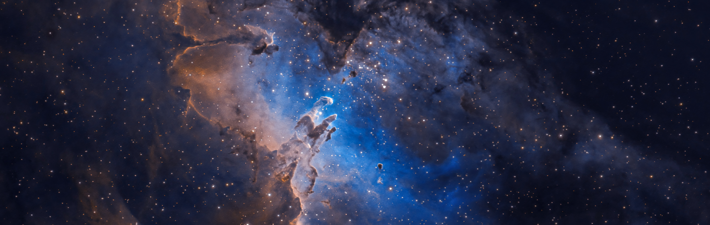

  
  <h1 style="color: #234465;">Hi, I'm Anuraag 👋</h1>
  

    <em>[𝗜 𝗘𝘅𝗶𝘀𝘁]</em> 
    "Embedded Systems Engineer | Open-Source Contributor | Passionate about hardware-software integration"
  

  <!-- Social Media Badges -->
  

    
    

  

---

### 🚀 About Me
I'm an Soon to Be Embedded Systems Engineer with 3 years of experience in . I specialize in C , Rust ,and hardware design, and I love building things that solve real problems and make a difference. Whether it's designing embedded systems or exploring my passion for astronomy, I'm always excited about innovation, technology, and creating something meaningful.

- 🌍 Based in India (•ᴗ<)✧
- 🔧 Currently focused on RTOS-based IoT device
- 🌱 Learning Rust for embedded systems
- 💡 Open to collaboration on embedded systems and IoT solutions
<!-- -->
---

### 🛠️ Skills & Tools

  
  
  
  
  
  
  
  

   I'm a PROMPT ENGINEERING GOD 

---

### 🌟 Featured Projects
Here are some projects I'm proud of:

#### Home Automation with Raspberry PI and ESP8266
- **Description**: An IoT-based smart home controller using RTOS.
- **Tech Stack**:  Linux,MQTT,AWS,NodeRED
- **Highlights**: Implemented with real-time data processing, optimized for low power consumption.
- 

---

### 📊 GitHub Stats

  
  
  

---

### 📝 Latest Blog Posts (on The way)
<!-- Optionally, you can integrate your blog posts using RSS or manually list them -->

---

### 🤝 Let's Connect!
I'm always excited to connect with like-minded individuals, collaborate on projects, or discuss new opportunities. Feel free to reach out via:

- 📧 Email: 𝔸ꈤυraag4sun@gmail.com
- 💼 LinkedIn: https://www.linkedin.com/in/anuraag-d-955b48221

  <h3 style="color: #234465;">Thanks for visiting my profile! 🚀</h3>
  

